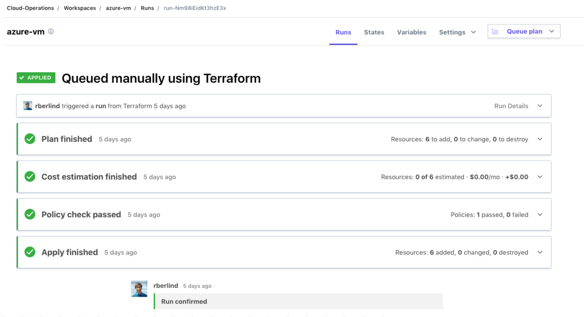
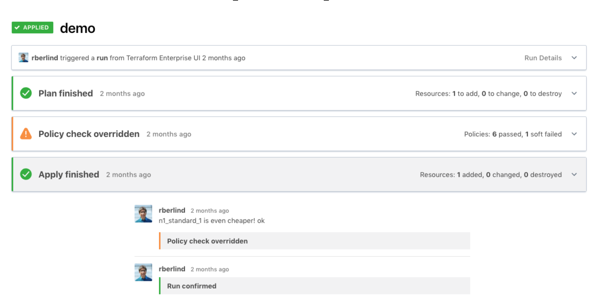
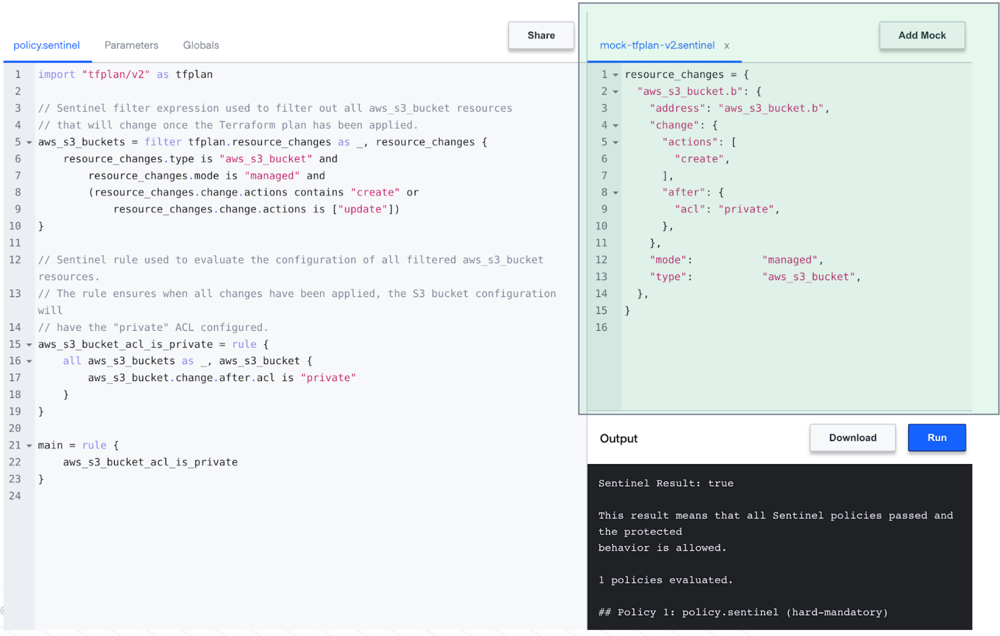
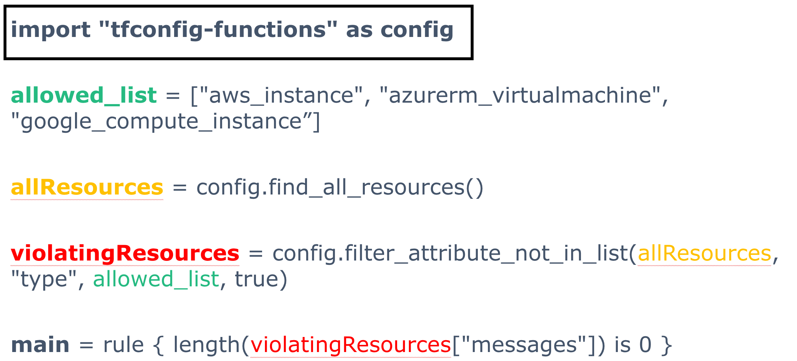
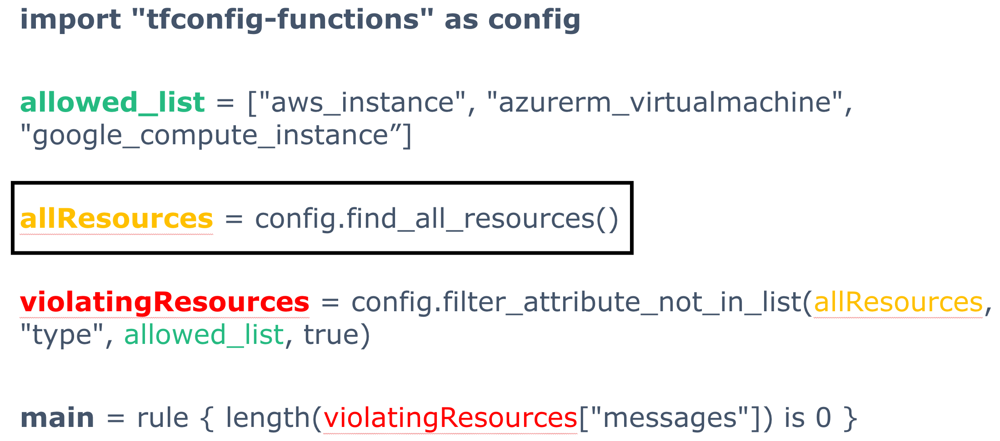
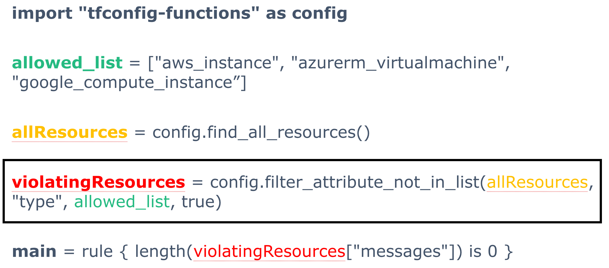
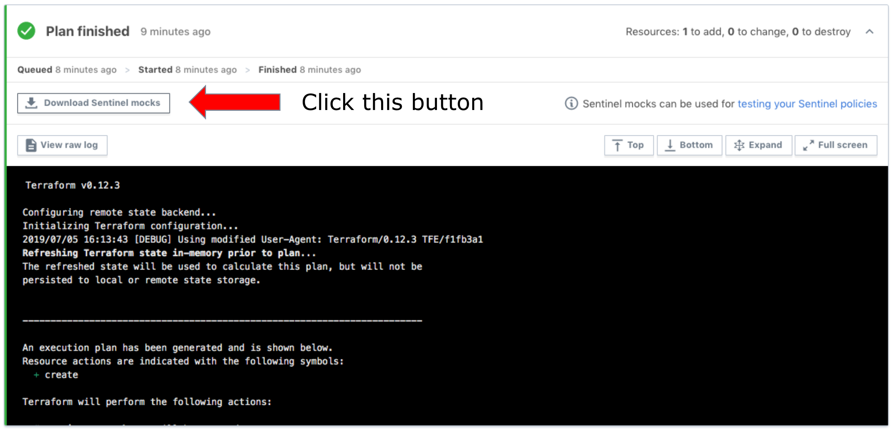

name: d1m5-sentinel-policy-enforcement
class: title, smokescreen, shelf
background-image: url(https://hashicorp.github.io/field-workshops-assets/assets/bkgs/HashiCorp-Title-bkg.jpeg)
count: false

# Sentinel for Terraform Workshop (v5)
## <Instructor>


---
name: tf-section
class: title, smokescreen, shelf
layout: true


background-image: url(https://hashicorp.github.io/field-workshops-assets/assets/bkgs/HashiCorp-Title-bkg.jpeg)
background-size: cover

.footer[

- Copyright © 2020 HashiCorp
]

---
layout: true

background-image: url(../images/bkgs/HashiCorp-Content-bkg.png)
background-size: cover

.footer[

- Copyright © 2020 HashiCorp
]

---
name: slide-deck
exclude: true
class: img-left-full


<br><br><br>
.center[
Follow along at this link:

## https://git.io/JvSPW
]
---
name: agenda
class: cozy

# Workshop Adgenda

<b>
- Introduction to Sentinel Concepts
- *Lab Challenge 1:* Using Sentinel CLI
- *Lab Challenge 2:* Applying and Testing a Policy with the CLI
- The Sentinel Language
- Key Concepts
- Sentinel Imports and Modules
- Advanced Concepts
- Writing Sentiel Policies and Testing Them
- *Lab Excersise 3-4:* Write and Test more Policies
- Advanced Techniques
- Extra Credit

</b>

---
class: title, smokescreen, shelf
background-image: url(https://hashicorp.github.io/field-workshops-assets/assets/bkgs/HashiCorp-Title-bkg.jpeg)
count: false

# Chapter 1 - Introduction to Sentinel Concepts


---
name: sentinel-overview
# What is Sentinel

- Sentinel is a **Policy As Code** framework to enable fine-grained, logic-based policy

- *Sentinel is to a Policy Framework as Terraform is to Infrastructure as Code*


- It includes its own language and is embedded in HashiCorp’s Enterprise products.

- It supports fine-grained policies that use conditional logic. For example - "Is this image in the supported images list?"


- It includes a CLI that allows you to test and run policies.

---
name: sentinel-overview2
# What is Sentinel

- Sentinel is enabled as part of your provisioning workflow, ensuring that policies are checked each time Terraform runs
- Policy as Code takes your excel spreadsheets, legal, regulatory requirement documents and individual security best practice knowledge and turns it into Code.

.center[

]

- (allowed_types = [”350xlarge”,”289ssmall”,”101xssmall”])

---
name: benefits-of-policy
# Benefits of Policy as Code


- All the same benefits of Infrastructure as Code!
  - Version History, Change Control, Collaboration

- Easily share-able and consumable across multiple organizations and teams in Terraform Cloud

- Can be tested and iterated on in an automated fashion with real test data!*

???

Lorem ipsum dolor sit amet, consectetur adipiscing elit, sed do eiusmod tempor incididunt ut labore et dolore magna aliqua

---
name: customer-use-cases
# How Customers are Using Sentinel in Terraform

- HashiCorp customers are using Sentinel to enforce security standards:
  - Require all S3 buckets use the private ACL and be encrypted by KMS.
  - Restrict which roles the AWS provider can assume.
  - Prohibit specific resources, data sources, providers, or provisioners.

**# List of allowed providers** <br>
**allowed_list = ["aws", "local", "null", "random", "terraform", "tfe"]**

---
name: customer-use-cases2
# How Customers are Using Sentinel in Terraform

- HashiCorp customers are using Sentinel to avoid excessive costs:
  - Limit the sizes of VMs and Kubernetes clusters in public clouds
  - Limit the monthly spend of each Terraform workspace

- Other
  - Enforce mandatory tags on resources provisioned by Terraform
  - Mandate that all modules come from a Private Module Registry

**# List of allowed resources** <br>
**allowed_list = ["aws_instance", "azurerm_virtualmachine", "google_compute_instance"]**

---
name: what-does-sentinel-not-do
# What Sentinel Does Not Do in Terraform

- Continually check infrastructure to validate compliance
- Remove existing resources that violate policies
- Ensure that resource attributes are valid
  - For instance, Sentinel can validate that a KMS key is specified for an S3 bucket, but not that it is a valid key
  - Can’t check if “SuperLargeBigInstance” is a valid type
- Analyze or limit runtime actions of deployed applications

---
name: where-is-sentinel-used
# Where is Sentinel Used in Terraform?

- **Sentinel Policies** are checked between the standard **plan** and **apply** steps of Terraform runs.
- Policies have different enforcement levels
- Sentinel policies can evaluate the **attributes** of existing and new resources based on information from the current run:
  - the plan, the configuration, the current state, and other run data including cost estimates
- This ensures that resources comply with all policies **before** they are provisioned.

---
name: without-sentinel
# Terraform Without Sentinel

<br>
.center[

]

---
name: with-sentinel
# Terraform With Sentinel

.center[

]

---
name: policys-passed
# All Policy Checks Passed

.center[

]

---
name: policys-passed2
# All Policy Checks Passed

.center[

]

---
name: enforcement-levels
# Sentinel Policy Enforcement Levels

- **Advisory**
  - Only logs violations
- **Soft Mandatory**
  - Can be overriden by authorized users
- **Hard Mandatory**
  - Cannot be overriden by anyone

- Customers often create new Sentinel policies as Advisory, then transition to Soft Mandatory, and eventually to Hard Mandatory
- This gives Terraform coders time to adapt and modify their code

???

Fix later too annoying

---
name: soft-mandatory
# A Soft Mandatory Policy Check Was Overridden

.center[

]

---
name: policy-sets
# Sentinel Policy Sets and Policies

- **Policy Sets** are groups of **Sentinel Policies** (and optionally Sentinel Modules)
  - They can be enforced on all workspaces or only on selected workspaces within one or more organizations.
- They are usually created in VCS repositories and then registered with organizations using the Terraform Cloud UI or API.
- Additionally, **Parameters** can be added to policy sets allowing the secure introduction of credentials needed by API endpoints invoked with the Sentinel HTTP import.

---
name: chapter-summary
# Chapter Summary

- Sentinel is Policy as Code framework
- Terraform Cloud automatically runs Sentinel checks between **plan and apply**
- Sentinel has different enforcement levels, **Advisory, Soft and Hard Mandatory**

---
class: title, smokescreen, shelf
background-image: url(https://hashicorp.github.io/field-workshops-assets/assets/bkgs/HashiCorp-Title-bkg.jpeg)
count: false

# Chapter 1 - Complete


---
name: c1-references
# References

- <a href="https://docs.hashicorp.com/sentinel">Sentinel Documentation</a>
- <a href="https://www.terraform.io/docs/cloud/sentinel/index.html">Terraform Cloud with Sentinel</a>
- <a href="https://github.com/hashicorp/terraform-sentinel-policies">GitHub Repository with Sample Sentinel Policies for AWS, Azure, GCP, and VMware as well as useful common functions in modules</a>
- <a href="http://WritingAndTestingSentinelPoliciesForTerraform-v3.0.pdf">Guide to Writing and Testing Sentinel</a>
- [Introducing Sentinel](https://www.hashicorp.com/sentinel/)
- [Writing and Testing Sentinel - An Indepth Guide](https://www.hashicorp.com/resources/writing-and-testing-sentinel-policies-for-terraform/)

???

Update to all same format please

---
class: title, smokescreen, shelf
background-image: url(https://hashicorp.github.io/field-workshops-assets/assets/bkgs/HashiCorp-Title-bkg.jpeg)
count: false

# Workshop Challenge 1: Using the Sentinel CLI


---
name: challenge-one
# Challenge 1: Using the Sentinel CLI

- The hands-on lab exercises of this workshop are done in an interactive learning platform Instruqt

- For this workshop, please use links provided by your instructor for these tracks:
  - Sentinel CLI Basics
  - Sentinel for Terraform v4

- In the first challenge of the first track, you'll learn how to run Sentinel CLI commands.

---
name: instruqt-basics
# Instruqt Basics

- The Instruqt platform organizes training content into Tracks consisting of multiple Challenges that must be solved in a specific order
- Each track launches one or more VMs and/or Docker containers and exposes terminals, file editors, and user interfaces on Tabs
- Information about each challenge is displayed on Note screens while it is loading. A Start Button will be shown when the challenge is ready.
- Detailed instructions are listed in an Assignment to the right of the tabs.
- You can click the Check Button to verify if you have completed the assignment. If you have, you will advance to the next challenge. Otherwise, you will be given a hint about what to do next.
- We recommend you review Instruqt's own tutorial track for more details

---
class: title, smokescreen, shelf
background-image: url(https://hashicorp.github.io/field-workshops-assets/assets/bkgs/HashiCorp-Title-bkg.jpeg)
count: false

# Workshop Challenge 2: Applying and Testing Policies


---
name: Challenge 2: Applying and Testing Policies

- In the second challenge, you'll learn how to apply and test a simple Sentinel policy with the Sentinel CLI.

- Please continue in your running instance of the Sentinel CLI Basics track by clicking the green Check button.

---
class: title, smokescreen, shelf
background-image: url(https://hashicorp.github.io/field-workshops-assets/assets/bkgs/HashiCorp-Title-bkg.jpeg)
count: false

# Chapter 2 - Sentinel Language Key Concepts


---
name: what-do
# What Does Sentinel DO in Terraform?

- Sentinel has the ability to “check” any resources inside Terraform
- Using the concept of ‘imports’ Sentinel can get data from Terraform;
  - Plan
  - Config
  - Run
  - Much much more!

---
name: what-does-it-look-like
# What Does a Sentinel Check Look Like?

.center[

]

---
name: behind-the-scenes
# The Engine Behind the Scenes

.center[

]

---
name: normal-view
# The UI View

.center[

]

---
name: mock-intro
# Sentinel Mocks in Terraform

- Sentinel **Mocks** simulate the data from Terraform plans
  - They can be generated from Terraform Cloud
- **Mocks** can be edited and modified to simulate other data
- They enable testing of Terraform Sentinel policies with the Sentinel CLI.
- Using the Sentinel CLI with mocks speeds up development of new policies since additional plans do not need to be run.

---
name: policy-intro-0
# Sentinel Policy Introduction – Concepts (0)

- Imports
  - Modules and Functions
- Declare criteria to evaluate against
  - Approved images, “Right” ports to use, “allowed” regions
- Find all resources in Terraform to evaluate against
  - Find all images, find all port configurations, find all regions
- Evaluate
- Test
- Print

---
name: policy-intro-1
# Sentinel Policy Introduction – Concepts (1)

.center[

]

---
name: policy-intro-2
# Sentinel Policy Introduction – Concepts (2)

.center[

]

---
name: policy-intro-3
# Sentinel Policy Introduction – Concepts (3)

.center[

]

---
name: policy-intro-4
# Sentinel Policy Introduction – Concepts (4)

.center[

]

---
name: policy-intro-5
# Sentinel Policy Introduction – Concepts (5)

.center[

]

---
name: policy-deep-dive
class: compact
# Sentinel Policies Deep Dive
Functions
```
Execute various statements and return a value.
### find_resources ###
	# Find all resources of a specific type using the tfplan/v2 import.
	# Include resources that are not being permanently deleted.
	# Technically, this returns a map of resource changes.
	find_resources = func(type) {
  	resources = filter tfplan.resource_changes as address, rc {
  		rc.type is type and
  		rc.mode is "managed" and
  		(rc.change.actions contains "create" or rc.change.actions contains "update" or
    	 rc.change.actions contains "read" or (rc.change.actions contains "no-op" and
     	rc.change.after is not null))
  	} return resources }
```

???

clean up
---
name: functions-intro
# Sentinel Policies Deep Dive

- OR
  - **Functions**
    - import "tfconfig-functions" as config

---
name: functions-def
class: compact
# Sentinel Functions

- A Sentinel **Function** is declared with the **func** keyword.

```
find_resources = func(resource_type) {
  # Do something and use the parameter
  return true
}
```
- Each function has a name such as **find_resources**.
- Each function can have zero or more parameters.
  - The function above has the single parameter, **resource_type**
- Every function must return a value such as **true**.
- A call to this function could look like:
  - **s3_buckets = find_resources("aws_s3_bucket")**

---
name: builtin-functions
# Builtin Functions

- Sentinel includes some useful **Builtin Functions:**
  - **append**		Appends a value to the end of a list
  - **delete**		Deletes an element from a map
  - **error**	Immediately exit with an error message
  - **keys**		Returns the keys of a map
  - **length**		Returns the length of a collection or string
  - **print**		Prints what you tell it to.  Always returns true.
  - **range**		Returns a list of numbers in a range.
  - **values**		Returns the values of a map.

---
name: reserved-words
class: col-2
# Sentinel Keywords

- all
- any
- as
- break
- case
- continue
- else
- filter
- for
- func
</br>
</br>
</br>
- if
- is
- import
- map
- param
- return
- rule
- when

???

fix later

---
name: chapter-summary
# Chapter Summary

- A basic rule of thumb is that Sentinel policies contain;
  - Imports/Modules/Functions
  - Evaluation Criteria (**Negative or Positive**)
  - A ’Search’ for any resources to test
  - **ONE** main rule
    - **At least one, but could be many**
- Sentinel has built in functions
  - There’s also common functions you can consume!

---
class: title, smokescreen, shelf
background-image: url(https://hashicorp.github.io/field-workshops-assets/assets/bkgs/HashiCorp-Title-bkg.jpeg)
count: false

# Chapter 2 - Complete


---
class: title, smokescreen, shelf
background-image: url(https://hashicorp.github.io/field-workshops-assets/assets/bkgs/HashiCorp-Title-bkg.jpeg)
count: false

# Chapter 3 - Sentinel Imports and Modules


---
name: policy-imports
class: compact
# Sentinel Policy - Imports

- A policy can include imports which enable a policy to access reusable libraries, external data and functions
- Imports enable Sentinel to access External Data
  - Sentinel ships with a set of standard imports
  - For example, the import:json capability allows you to parse and access a JSON document

- The true power in Sentinel is using imports/plugins to make policy decisions on any source of data!
  - Import “http” enables the use of HTTP-accessible data from outside the runtime in Sentinel policy rules.
  - Simply put I can query any URL to use data in Sentinel!

---
name: sentinel-imports
# Standard Sentinel Imports

- Standard Imports
  - base64
  - decimal
  - http
  - json
  - runtime
  - sockaddr
  - strings
  - time
  - types
  - units
  - version

---
name: common-operations
# Common Operations of the Standard Imports

- Check if a string has a prefix: **strings.has_prefix(s, prefix)**
- Check if a string has a suffix: **strings.has_suffix(s, suffix)**
- Check the type of a Sentinel object: **types.type_of(obj)**
- Make external calls to API endpoints: **response = http.get("https://example.hashicorp.com")**
- Convert a JSON object to a Sentinel structure: **json.unmarshal(response.body)**

---
name: imports-in-terraform
# Sentinel Imports in Terraform

- A policy can include imports which enable a policy to access reusable libraries, external data and functions

- Imports are Sentinel’s way of accessing data
- Remember that Sentinel is embedded across HashiCorp’s Enterprise tools
  - Cool hint: if you’re using more than one HashiCorp product you could get Sentinel data from them!

- Terraform Cloud provides four imports to define policy rules for the plan, configuration, state, and run associated with a policy check

---
name: imports-in-terraform-2
class: compact
# Sentinel Imports in Terraform

- **tfplan/v2**
  - gives data generated from Terraform plans

- **tfconfig/v2**
  - gives data about the Terraform configuration

- **tfstate/v2**
  - gives data about the current state of a workspace

- **Tfrun**
  - gives metadata for Terraform runs and their workspaces as well as cost estimate data

---
name: types-of-policies
class: compact
# Types of Terraform Sentinel Policies

There are essentially four types of Terraform Sentinel policies corresponding to the 4 Terraform Sentinel imports:
- Policies can use the tfplan/v2 import to restrict specific attributes of specific resources and data sources in the current Terraform plan.
- Policies can use the tfconfig/v2 import to restrict the configuration of Terraform modules, variables, resources, data sources, providers, provisioners, and outputs.
- Policies can use the tfstate/v2 import to check whether previously provisioned resources or data sources have attributes with values that are no longer allowed.
- Policies can use the tfrun import to check workspace and run metadata and whether cost estimates for planned resources are within limits.
  - Some policies might use more than one of these imports.

---
name: sentinel-modules
# Sentinel Modules

- Modules allow you to re-use Sentinel code as an import
  - import “tfplan-functions”

- Sentinel modules are registered in Sentinel CLI configuration files and in TFC/TFE policy set configuration files

- There are some AMAZING getting starting Modules available in GitHub!
  - **Example**
  - **find_resources_by_provider** and **find_datasources_by_provider** functions that find resources or data sources for a specific provider

---
name: chapter-summary
# Chapter Summary

- Sentinel contains imports that allow it to access external data
- In Terraform we use these imports to access **Plan, Config, State and Run Data!**
- Sentinel makes use of **Modules** to make use of **Functions** in a repeatable way!
  - There’s lots of re-usable Modules and Functions available on GitHub to get started!

---
class: title, smokescreen, shelf
background-image: url(https://hashicorp.github.io/field-workshops-assets/assets/bkgs/HashiCorp-Title-bkg.jpeg)
count: false

# Chapter 3 - Complete


---
class: title, smokescreen, shelf
background-image: url(https://hashicorp.github.io/field-workshops-assets/assets/bkgs/HashiCorp-Title-bkg.jpeg)
count: false

# Chapter 4 - Sentinel Language Advanced Concepts


---
name: language-const
# Key Sentinel Language Constructs (1)

- **Boolean Expressions:** Evaluate to true, false, or undefined.
  - They use logical, comparison, set, and other **Operators.**
  - (5*2 == 10) and (7 in [ 2, 3, 5, 7, 11, 13, 17, 19])
- **Rules:** Evaluate a single expression which could be the result of calling a single function.
- **Main Rule:** Every Sentinel policy must have a rule called main.
  - The result of a policy is the value returned by its main rule.
- **Statements:** Execute procedural logic.
- **Functions:** Execute various statements and return a value.
- **Variables:** Store values for use by rules and functions.
- **Parameters:** Accept inputs passed to policies.

---
name: language-const-2
# Key Sentinel Language Constructs (2)

- **Types:** boolean, integer, float, string, list, map
  - A **List** is a collection of zero or more items
  - A **Map** is a collection of zero or more key/value pairs
- **Operators:** Arithmetic, Logical, Comparison, Set, Matches, Else
- **Assignments:** Set the value of variables.
- **If/Else and Case Statements:** Specify conditional execution of different logic within a function.
- **For Loops:** Repeat statements while iterating over a map or list.
  - Frequently used inside functions
  - **break** and **continue** statements can alter loop execution.
- The **Filter** quantifier expression that returns a subset of a collection.
- **Imports:** Reusable libraries of Sentinel functions.

---
name: pre-clared
class: col-2
# Sentinel Pre-declared Identifiers
Constants:
- false
- true
- null
- undefined

</br>
Type Conversion Functions:
- bool
- float
- int
- string

???
fix later

---
name: logic-operators
# Sentinel Numerical and Logical Operators

- **Arithmetic:** +, -, *, /, and % (remainder)
- **p and q**	p and q must both be true
- **p or q**	at least one of them must be true
- **p xor q**	exactly one of them must be true
- **!p**		p is false
- **not p**		p is false

---
name: comparison
# Sentinel Comparison Operators

- **==**		equal to
- **!=**		not equal to
- **<**		less than
- **<=**		less than or equal to
- **>**		greater than
- **>=**		greater than or equal to
- **is**		equal to
- **is not**	not equal to

Note that maps and lists are comparable!

---
name: short-circuit
# Sentinel's Short-Circuit Logic

- Sentinel applies Short-Circuit Logic for compound boolean expressions like p and q and (a and b) or c:
- This means that Sentinel does not evaluate all conditions further to the right if it already knows the final answer.
  - So, if p is false, it does not evaluate q since p and q is already false.
  - If a and b are both true, it does not evaluate c since (a and b) or c is already true.
  - If a is false, it does not evaluate b since a and b is already false, but it does evaluate c since (a and b) or c could still be true or false, depending on the value of c.

---
name: set
# Sentinel Set Operators

- Set operators can be applied to lists, maps and strings.
- For strings, the set operators do substring inclusion
- Examples for lists:
  - **1 in [1, 2, 3]**			Means that 1 is in the list
  - **[1, 2, 3] contains 2**	Means that the list contains 2.
  - **[] is empty**			Means that the collection is empty.
- You can also use **not in, not contains, and is not empty.**

---
name: matches
# The Sentinel Matches Operator

- The **matches** operator tests if a string matches a regular expression.
- Examples:
  - **"test" matches "^te"**			# true
  - **"1352" matches "[0-9]*"**		# true
  - **"123A" matches "[0-9]*"**		# false
  - **"xyz.com matches ".*\\.com"**	# true

- The **strings import** can also be used to determine if a string has a specific prefix or suffix

---
name: else
# The Sentinel Else Operator

- The else operator converts the _undefined_ value to something else.
- If a number is _undefined_, you might convert it to 0
  - **(memory else 0) <= 2048**
- If a boolean is _undefined_, you might convert it to true or false.
  - **(memory <= 2048) else false**
- If a list is _undefined_, you might convert it to the empty list, [].
  - **keys(tfplan.resource_changes) else []**
- If a map is _undefined_, you might convert it to the empty map, {}.
  - **allEC2Instances else {}**
- Note that the _else_ operator does not affect null.

---
name: for-loops
# Sentinel For Loops

- A Sentinel **for** loop iterates over a collection.
- Each for loop uses the **as** keyword to define one or two iterator variables.
- When iterating over a list, the first variable is assigned the index and the second variable is assigned the value.
  - If only one iterator variable is specified, it is assigned the value.
- When iterating over a map, the first variable is assigned the key and the second variable is assigned the value.
  - If only one iterator variable is specified, it is assigned the key.

---
name: for-loop-example
class: compact
# Sentinel For Loop Examples

- This example iterates over a list with one variable (for the values).
```
count = 0
for [1, 2, 3] as num {
  count += num
}
```

---
name: for-loop-example
class:compact
# Sentinel For Loop Example

- The count will equal 6.
  - This example iterates over a map with two variables:
```
data = { "a": 12, "b": 32 }
for data as k, v {
  sum += v
}
```

- The sum will equal 44.

---
name: all-any
# The Sentinel all and any Expressions

- The **all** and **any** quantifier expressions are are used like loops, but they are actually quantifier expressions that apply boolean expressions to lists and maps. They return _true_ or _false_.
- The _all_ expression is a universal quantifier asserting that a boolean expression must be true for all items of a collection.
- The _any_ expression is an existential quantifier asserting that a boolean expression must be true for at least one item in a collection.
- It used to be common to use all expressions in Sentinel rules, but it is better to use for loops in functions called before the main rule.
- This allows your policies to report all violations in a single shot.

---
name: filter-map
# The Sentinel filter and map Expressions

- The **filter** quantifier expression applies a boolean expression to each item in a list or map.
  - However, instead of returning true or false, it returns a sub-collection of the original collection consisting of those items for which the boolean expression was true.
  - The _filter_ expression is useful with the Terraform Sentinel v2 imports since their collections were designed to be used with it.
- The **map** quantifier expression returns a list of values, one for each item in the collection it is applied to.
  - It can be useful in Sentinel rules that want to return non-boolean values including maps and lists.

---
name: if-else
# The Sentinel If/Else Conditional

- This example tests if _v_ is defined and equal to _value_:

```
if v else null is null {
  print("The value", v, "was null or not defined")
} else if v is not value {
  print(v, "is not equal to the required value", value)
} else {
  print(v, "is the desired value", value)
}
```

---
name: case
# The Sentinel Case Conditional

- This example does different processing for different days:

```
case day {
when "Saturday", "Sunday":
	print("Sorry, we are closed.")
else:
	print("We are open from 9am to 6pm.")
}
```

---
class: title, smokescreen, shelf
background-image: url(https://hashicorp.github.io/field-workshops-assets/assets/bkgs/HashiCorp-Title-bkg.jpeg)
count: false

# Chapter 4 - Complete


---
class: title, smokescreen, shelf
background-image: url(https://hashicorp.github.io/field-workshops-assets/assets/bkgs/HashiCorp-Title-bkg.jpeg)
count: false

# Chapter 5 - Writing and Testing Sentinel Policies for Terraform


---
name: mocks-in-tf
# Sentinel Mocks in Terraform

- Sentinel **Mocks** simulate the data that is made available to the Terraform Sentinel imports from Terraform plans.
- They can be generated from recent plans using the Terraform Cloud UI and API.
- They can also be copied and edited to simulate various combinations of resource and data source attributes.
- They enable testing of Terraform Sentinel policies with the Sentinel CLI.
- Using the Sentinel CLI with mocks speeds up development of new policies since additional plans do not need to be run.

---
name: methodology-0
# Basic Methodology for Restricting Resources

- The Eight Steps of the recommended methodology are:
1. Create a Terraform configuration that creates the resource.
2. Create a workspace that uses your Terraform configuration.
3. Run a plan against the workspace.
4. Generate mocks against the plan in the TFC UI.
5. Write a new Sentinel policy.
6. Create test cases and test your policy with the Sentinel CLI.
7. Revise your policy and test cases until the latter all pass.
8. Deploy your policy to a TFC organization.

---
name: methodology-1
# Create a Terraform Configuration

- Create a Terraform configuration that creates at least one instance of the resource your policy will restrict.
  - Include a main.tf file to create the resource.
  - Include a backend.tf file to configure the remote backend (if you would like to use the remote backend).
- Use variables to set the values of the attributes being restricted.
- Create more than one instance of the resource to test your policy's ability to correctly handle some that pass and some that fail.

---
name: methodology-1
# Create a Terraform Configuration: main.tf

```
variable "ami_id" {
  default = "ami-2e1ef954"
}

variable "instance_type" {
  default = "t2.micro"
}

resource "aws_instance" "ubuntu" {
  count         = 2
  ami           = "${var.ami_id}"
  instance_type = "${var.instance_type}"
}
```

---
name: methodology-2
class: compact
# Terraform Terminology for Resources

- Let's consider the declaration of the resource from the last slide.
```
resource "aws_instance" "ubuntu" {
  count         = 2
  ami           = "${var.ami_id}"
  instance_type = "${var.instance_type}"
}
```
- In this case, "aws_instance" is the **Type** of the resource while "ubuntu" is its **Name.**
- Each occurrence of a resource is referred to as a **Resource Instance.**
- This Terraform code will create two **Instances** of the resource since count was set to 2.

---
name: methodology-3
# Create a Terraform Configuration: backend.tf

```
terraform {
  backend "remote" {
    hostname = "<your_TFE_server>"
    organization = "<your_org>"

    workspaces {
      name = "<your_workspace>"
    }
  }
}
```

---
name: methodology-4
# Generate a User API Token

- In order to use the remote backend against a TFC/TFE server, you need to generate a User API Token for yourself.
- You then need to list the token in your Terraform CLI configuration file.
  - On a Mac or Linux machine, this will be the .terraformrc file in your home directory.
  - On a Windows machine, this will be the terraform.rc file in your %APPDATA% directory.
- The token should be added in a section like this:
```
credentials "app.terraform.io" {
  token = "<token>"
}
```

---
name: methodology-5
# Create a TFC or TFE Workspace

- If you trigger your plan with the remote backend, you do not need to set up a VCS connection.
- Click "CLI-driven workflow" when creating your workspace when prompted to connect to a version control provider.
- You still need to add environment variables such as cloud credentials to your workspace since local ones are not sent to the server.
- Several tools can push Terraform and environment variables:
  - set-variables.sh
  - tf-helper (tfh)

---
name: methodology-6
# Create a Workspace in the TFC/TFE UI

.center[

]

---
name: methodology-7
# Set Variables in Your Workspace

.center[

]

---
name: methodology-8
# Run a Plan and Generate Mocks Against It

- From your local directory containing main.tf and backend.tf, run _terraform init_ to initialize your Terraform configuration.
- Then run terraform plan.
- The plan will run on the TFC server, but its results will be visible locally and in the TFC UI.
- To see the run in the TFC UI, copy the URL displayed near the top of the local version of the plan and navigate to it with a browser.
- To generate mocks against your plan, click the "Download Sentinel mocks" button.
- After a minute, a tar.gz file will be downloaded with 7 mocks.
- Extract the mock files from the tar.gz file.

---
name: methodology-9
# Generate Mocks Against Your Plan

.center[

]

---
name: methodology-10
# Writing Sentinel Policies for TFC/TFE

- Sometimes, you might be asked to create a Sentinel policy to restrict particular things such as VMs or load balancers.
- But you might not know the exact Terraform resources that implement these.
- Fortunately, you can use the Terraform Provider documentation to identify resources that implement the things you want to restrict.
- Each resource and data source has its own documentation page.
- Looking at documentation from the underlying cloud service provider or other technology will also help.
  - For instance, you can determine valid values for VM size.

---
name: methodology-11
# Write a Terraform Sentinel Policy

- The next set of slides walks you through a Sentinel policy called **"restrict-ec2-instance-type.sentinel"** that restricts the allowed sizes of AWS EC2 instances.
- It breaks down the Sentinel code into smaller bites, clarifying what each section of the code is doing.

---
name: methodology-12
# Sentinel Import Declarations

```
# Import tfplan-functions.sentinel with alias "plan"
import "tfplan-functions" as plan
```

---
name: methodology-13
# List of Allowed Values

```
# Allowed EC2 Instance Types
allowed_types = ["t2.small", "t2.medium", "t2.large"]
```

---
name: methodology-14
# Call Sentinel Functions to Find and Filter Resources

```
# Get all EC2 instances
allEC2Instances = plan.find_resources("aws_instance")

# Filter to EC2 instances with violations
# The called function prints warnings for all violations
violatingEC2Instances = plan.filter_attribute_not_in_list(allEC2Instances, "instance_type", allowed_types, true)
```

---
name: methodology-15
# Calculate Boolean and Check it in Main Rule

```
# Count violations
# We determine length of the messages map within the
# violatingEC2Instances object
violations = length(violatingEC2Instances["messages"])

# Main rule
main = rule {
  violations is 0
}
```

---
name: common-functions
# Common Functions

- The Instruqt track in this workshop embeds two Sentinel modules with many common functions that can be used in policies.
- These are copies of the functions located here.
- The policy we just examined called the following functions:
  - **find_resources(type)**
  - **filter_attribute_not_in_list(resources, attr, allowed, prtmsg)**
- There are other find and filter functions in the above modules.
- The filter functions print all violations if prtmsg is true.
- Additionally, the filter functions call a very useful function:
  - **evaluate_attribute(r, attribute)**

---
name: find-all
# Function That Finds All Resources By Type

```
# Find all resources of a specific type from all modules
# Only include resources that are being created or updated
find_resources = func(type) {
  resources = filter tfplan.resource_changes as address, rc {
  	rc.type is type and
  	rc.mode is "managed" and
  	(rc.change.actions contains "create" or
	 rc.change.actions contains "update" or
       rc.change.actions contains "read" or
       rc.change.actions contains "no-op")
  }
  return resources
}
```

---
name: filter-resources
class: compact
# Function That Filters Resources

```
filter_attribute_not_in_list = func(resources, attr, allowed, prtmsg) {
  violators = {}
  messages = {}
  for resources as address, rc {
    v = evaluate_attribute(rc, attr) else null
    if v not in allowed {
      message = to_string(address) + " has " + to_string(attr) + " with value " + to_string(v) +
                " that is not in the allowed list: " + to_string(allowed)
      violators[address] = rc
      messages[address] = message
      if prtmsg {
        print(message)
      }
    } // end if
  } // end for
  return {"resources":violators,"messages":messages}
```

---
name: eval-attribute
# Function that Evaluates Attributes

- The filter functions all call the evaluate_attribute() function that recursively calls itself to evaluate attributes that can be deeply nested inside a resource or data source.
- This function has the following declaration:
  - **evaluate_attribute = func(r, attribute)**
- The resource passed to the first call to the function should be in the form **rc.change.after** or just rc where rc is a resource change derived by applying filters to **tfplan.resource_changes.**
- The attribute should be given as a string delimited by "." in which indices of lists start with 0: "storage_os_disk.0.managed_disk_type".
- Do not use something like "storage_os_disk[0].managed_disk_type".

---
name: setup-test
# Set Up the Test Cases Directory for the CLI

- To test your policy with the Sentinel CLI, you first need to set up test cases that use the tfplan/v2 mock you generated earlier.
- Under the directory containing your policy, create a **test** directory.
- Under the test directory, create a directory with the same name as your policy, but without the ".sentinel" extension.
- So, for our restrict-ec2-instance-type.sentinel policy, we create the **restrict-ec2-instance-type** directory under the test directory.

---
name: copy-mocks
# Copy Mocks and Create Test Cases

- Copy the mock-tfplan-v2.sentinel mock file that you downloaded and extracted from your workspace to this directory.
- Change the name of the mock file to **mock-tfplan-pass.sentinel.**
- Create a second copy of the file called **mock-tfplan-fail.sentinel.**
- Create **pass.hcl** and **fail.hcl** files that have the text on the next two slides respectively.

---
name: pass-hcl
# The pass.hcl Test Case

```
module "tfplan-functions" {
  source = "../../../common-functions/tfplan-functions/tfplan-functions.sentinel"
}
mock "tfplan/v2" {
  module {
    source = "mock-tfplan-pass.sentinel"
  }
}
test {
  rules = {
    main = true
  }
}
```

---
name: fail-hcl
# The fail.hcl Test Case

```
module "tfplan-functions" {
  source = "../../../common-functions/tfplan-functions/tfplan-functions.sentinel"
}
mock "tfplan/v2" {
  module {
    source = "mock-tfplan-fail.sentinel"
  }
}
test {
  rules = {
    main = false
  }
}
```

---
name: pass-fail
# Edit the Pass and Fail Mocks

- Edit the mock-tfplan-pass.sentinel mock file and make sure that all values of **instance_type** are set to a value such as **"t2.small"** that is in the allowed_types list.
- Edit the mock-tfplan-fail.sentinel mock file and make sure that at least one value of **instance_type** is set to a value such as **"m5.large"** that is not in the allowed_types list.
- You should always have at least 1 fail and 1 pass test case.
- Sometimes, you will want multiple fail test cases and corresponding mocks.
- You might even want more than 1 pass test case and mock.

---
name: polcy-with-cli
# Test Your Policy with the CLI (1)

- Now that you have set up your test cases, you can test your policy with the Sentinel CLI.
- Navigate back to the directory containing your policy.
- Run the following command:
**sentinel test restrict-ec2-instance-type.sentinel**
- To see the outputs of the print statements, change this to:
**sentinel test –verbose restrict-ec2-instance-type.sentinel**
-You can also apply a policy with the sentinel apply command, but you must set up a Sentinel configuration file like the "sentinel.json" file downloaded with the mocks or a "sentinel.hcl" file.

---
name: policy-with-cli
#Test Your Policy with the CLI (2)

- The first command gives:
```
PASS - restrict-ec2-instance-type.sentinel
  PASS - test/restrict-ec2-instance-type/fail.hcl
  PASS - test/restrict-ec2-instance-type/pass.hcl
```

---
name: policy-with-cli
#Test Your Policy with the CLI (3)

- The second command gives:
```
PASS - restrict-ec2-instance-type.sentinel
  PASS - test/restrict-ec2-instance-type/fail.hcl
    logs:
       aws_instance.ubuntu[0] has instance_type t2.xlarge that is not in the allowed list:
       ["t2.small" "t2.medium" "t2.large"]
      restrict-ec2-instance-type.sentinel:24:1 - Rule "main
      	Description: Main rule Value: false
  PASS - test/restrict-ec2-instance-type/pass.json
     restrict-ec2-instance-type.sentinel:24:1 - Rule "main
      	Description: Main rule Value: true
```

---
class: title, smokescreen, shelf
background-image: url(https://hashicorp.github.io/field-workshops-assets/assets/bkgs/HashiCorp-Title-bkg.jpeg)
count: false

# Chapter 5 - Complete


---
class: title, smokescreen, shelf
background-image: url(https://hashicorp.github.io/field-workshops-assets/assets/bkgs/HashiCorp-Title-bkg.jpeg)
count: false

# Chapter 6 - Using Sentinel in Terraform Cloud and Terraform Enterprise


---
